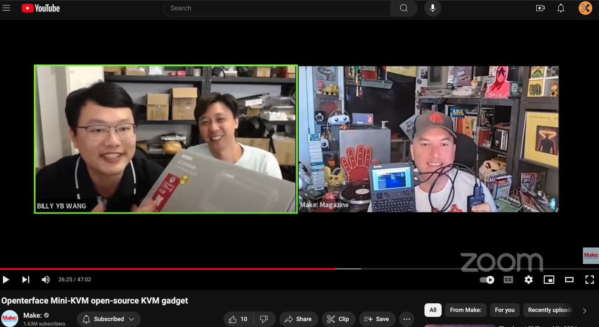
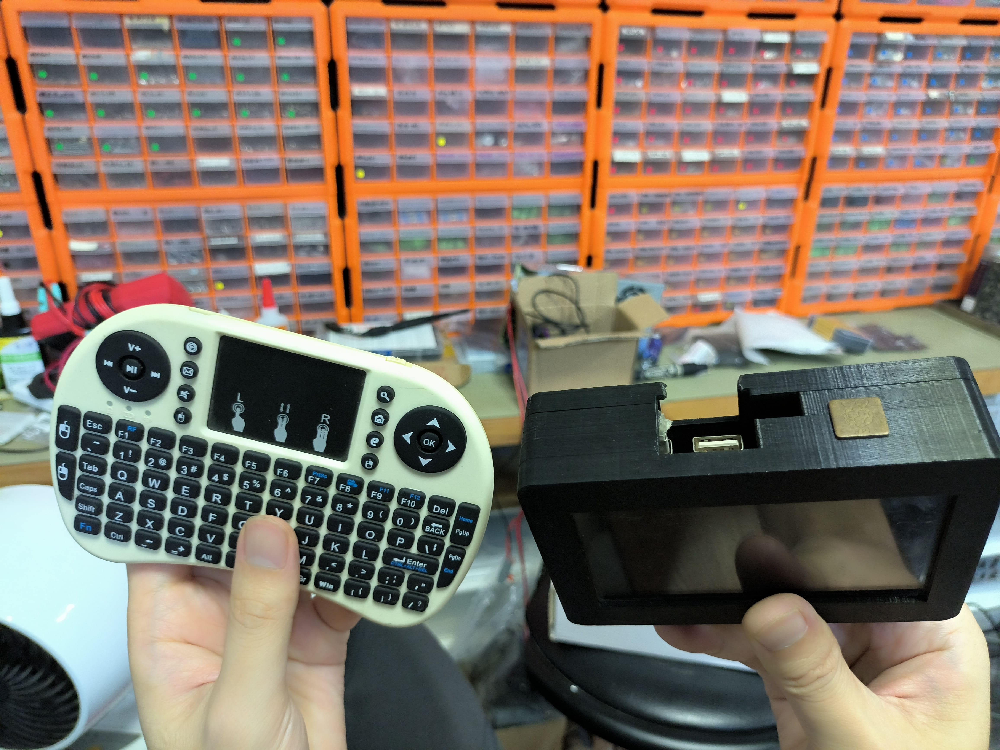
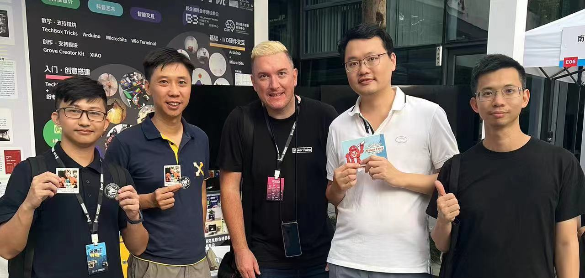
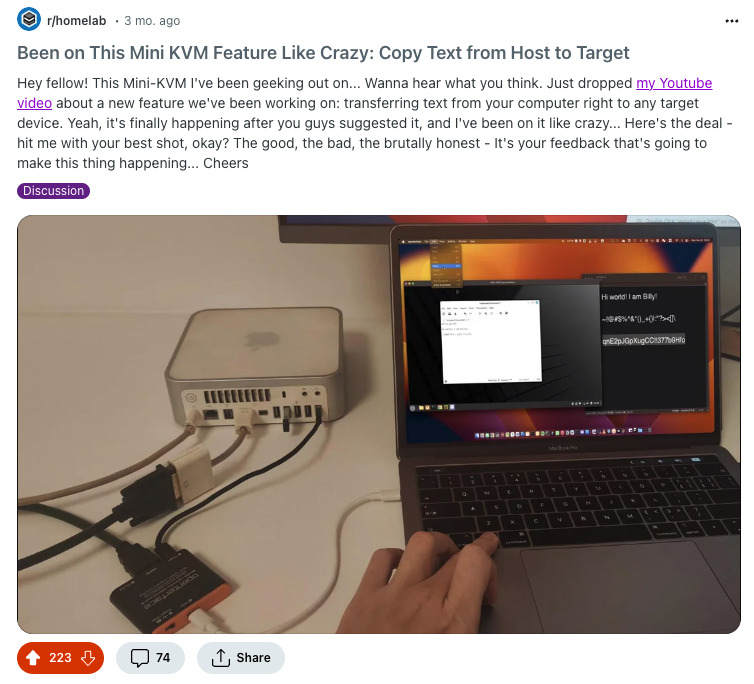

# MAKE: Magazine의 데이비드 그룸과의 캐주얼 대담: Openterface Mini-KVM 이야기 🎙️

안녕하세요 여러분!

방금 MAKE: Magazine의 데이비드 그룸과 함께 멋진 [유튜브 라이브 스트리밍](https://www.youtube.com/live/lwitzvmxsgc?si=s9a1t5_Sce5v22e1)을 마쳤습니다! 이 세션에서는 노트북만 사용하여 헤드리스 장치와 Raspberry Pis와 같은 싱글 보드 컴퓨터를 손쉽게 제어할 수 있도록 설계된 혁신적인 오픈 소스 하드웨어 솔루션인 Openterface Mini-KVM의 비하인드 스토리에 대해 자세히 알아봤습니다. 자세한 내용은 YouTube 라이브 스트리밍을 확인하시거나 아래 스토리를 읽어보세요.

<!-- more -->

## 아이디어의 탄생

Mini-KVM의 여정은 중국 광저우의 번화한 도시에서 TechxArtisan 스튜디오에서 시작되었습니다. 지난 5년 동안 저희는 현지 및 해외 예술가들을 위한 수많은 테크 아트 프로젝트에 깊이 관여해 왔습니다. 여기에는 AI 감지 기능을 갖춘 인터랙티브 조명 설치물, 극장 공연을 위한 로봇 팔, 무작위 미로를 해결하는 자율주행 미니카, 사막과 숲 같은 사람이 살지 않는 곳을 탐험하도록 설계된 로봇 개까지 포함됩니다.

### 흔한 골칫거리
업무에서 반복되는 어려움은 모니터, 키보드, 네트워크 연결이 없는 라즈베리 파이와 젯슨 나노 같은 수많은 헤드리스 컴퓨터를 관리하는 것이었습니다. 이로 인해 열악한 환경에서 문제를 해결하고 이러한 장치에 액세스하기 위해 여분의 모니터와 키보드를 찾느라 정신없이 검색해야 하는 경우가 많았습니다.

### 임시방편 솔루션
처음에는 배터리 팩으로 구동되는 임시 휴대용 모니터 솔루션과 터치패드가 있는 무선 미니 키보드를 사용했습니다. 하지만 이러한 솔루션은 종종 잊어버리거나 잘못 배치되는 경우가 많았고, 코딩과 설정을 위해 항상 휴대하는 노트북을 활용할 수 있는 전용 하드웨어 솔루션이 필요하게 되었습니다.

*이 두 가지 기기는 현장 프로젝트를 위해 반드시 휴대해야 합니다.

### 첫 번째 프로토타입
첫 번째 DIY 프로토타입은 헤드리스 장치에서 비디오를 가져오는 캡처 카드와 USB 키보드/마우스 시뮬레이터가 노트북에 연결되는 단일 USB 케이블에 통합된 간단하면서도 효과적인 조합이었습니다.

*초기 버전의 미니 KVM PCB 중 하나*.

저희는 2023년 11월 심천 메이커 페어에서 멋진 기술 예술 프로젝트를 선보이며 미니 KVM 프로토타입을 David에게 자랑하려고 했습니다. 하지만 데이비드로부터 받은 선물에 너무 흥분해서 잊어버리고 말았습니다!

*MAKE: 매거진의 스티커와 엽서는 정말 멋져요!

## 커뮤니티 피드백 및 개발
Reddit에 프로토타입을 공유한 후, [커뮤니티](http://openterface.com/community/#community-contributors)로부터 귀중한 피드백을 받아 솔루션을 개선하고 발전시켜 완성도 높은 제품으로 만들 수 있었습니다. 이러한 커뮤니티의 지원은 임시 장치를 홈랩족, 시스템 관리자, 기술 애호가 및 헤드리스 컴퓨터로 작업하는 모든 사람을 위한 세련되고 효율적인 도구로 탈바꿈시키는 데 큰 도움이 되었습니다.

*홈랩러들로부터 엄청난 양의 피드백을 받았습니다*.

## 의심 극복하기
처음에는 기존 유사 솔루션과의 경쟁에 대한 의구심이 있었지만, 온라인 커뮤니티의 긍정적인 반응과 건설적인 제안은 잠재적인 사용 사례를 명확히 하고 자신감을 높이는 데 도움이 되었습니다. 우리의 노력에 대한 이러한 지지와 긍정이 없었다면 프로젝트를 더 이상 진행하지 못했을지도 모릅니다.

## 크라우드 펀딩 및 향후 계획
크라우드 서플라이의 Openterface Mini-KVM 크라우드 펀딩 캠페인이 약 2주 앞으로 다가오면서 열기가 고조되고 있습니다. 이 캠페인은 단순히 Mini-KVM 개발에 관한 것이 아니라 커뮤니티가 주도하는 혁신의 힘을 보여주는 증거입니다. 다음 편에서는 생산 관리, 소프트웨어 개선, 그리고 멋진 오픈소스 커뮤니티를 통해 이 편리한 장치를 후원자들에게 전달하는 과정을 자세히 살펴보겠습니다.

*베타 테스터들이 일상적인 기술 업무에서 Openterface Mini-KVM을 사용한 경험을 TechxArtisan의 Discord*에서 공유하고 있습니다.

## 오픈 소스 비전 수용하기

Openterface Mini-KVM은 우리의 창의성과 인내, 그리고 지원적인 오픈 소스 커뮤니티의 증거입니다. 개인적인 문제를 해결하기 위한 간단한 솔루션으로 시작한 것이 이제는 전 세계 해커, 땜장이, 기술 애호가에게 도움이 되는 다목적 오픈 소스 도구로 발전했습니다. Mini-KVM의 공식 출시가 가까워짐에 따라 더 많은 업데이트를 기대해주세요!