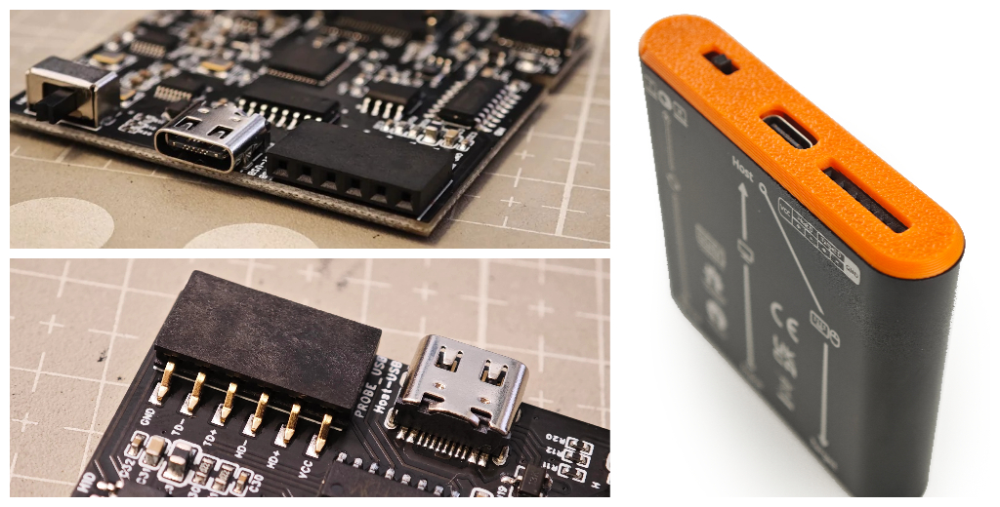

# 장애물 극복: 진행 상황 업데이트 및 새로운 일정

안녕하세요, 여러분.

잘 지내고 계신가요? 마지막 업데이트 이후로 시간이 꽤 흘렀네요. Openterface의 모든 것이 순조롭게 진행되었다고 말씀드리고 싶지만, 몇 가지 문제로 인해 배송 일정이 지연될 예정입니다. 예상치 못한 일이었지만, 우리는 이러한 도전에 정면으로 맞서고 있으며, 좋은 소식도 많이 있습니다. 이 글은 약 7분 정도 소요되니, 현재 상황과 앞으로의 계획에 대해 자세히 알아보도록 하겠습니다.

## 규제, 생산 및 품질

생산을 시작하기 전에, CE 인증을 포함한 필요한 품질 테스트를 통과해야 했습니다. Mini-KVM뿐만 아니라 여러 액세서리가 포함된 툴킷 버전이기 때문에 각 부품마다 CE 테스트를 거쳐야 했습니다. 예상보다 시간이 더 걸렸지만, **Mini-KVM과 모든 부품이 CE 인증을 통과했습니다!** 아래는 모든 부품에 대한 인증 개요입니다: Mini-KVM, HDMI 케이블, 주황색 Type-C 케이블, 짧은 검은색 Type-C 케이블, VGA2HDMI 케이블. 인증을 받은 덕분에 생산 일정이 확정되었고, 현재 제조업체에서 **모든 부품을 생산 중**입니다.

*우리 전자 제품의 경우 UKCA와 CE 요구 사항이 동일하며, CE는 RoHS 준수도 포함합니다.*

2주 전, 우리는 제조업체 중 한 곳을 방문하여 주황색 케이블의 품질 관리를 위해 라인 매니저들을 교육했습니다. 이제 모든 주황색 케이블이 생산되어 스튜디오 한쪽에 쌓여 있습니다.

*Kevin과 Shawn이 Openterface Mini-KVM과 주황색 케이블의 올바른 작동을 보장하기 위한 테스트 방법을 설명하고 있습니다.*

이번 주에는 다른 부품에 대해서도 동일한 작업을 수행하여 생산 전선에서 품질 관리를 교육할 예정입니다. 추가 케이블 샘플은 다음과 같습니다.

*TechxArtisan 로고가 자랑스럽게 새겨진 HDMI 케이블, 짧은 Type-C 케이블, VGA-to-HDMI 케이블 샘플입니다.*

제조업체로부터 다른 부품과 Mini-KVM이 곧 도착할 예정이며, 도착하면 모든 부품의 품질을 다시 확인하고 스튜디오에서 적절히 포장할 것입니다. 즉, **우리 팀이 직접 품질을 보장**하여 여러분의 손에 도달할 것입니다.

## 배송, 잠재적 지연 및 새로운 예상 도착일

**현재 불확실한 부분은 배송 과정**입니다. 여러 배송 회사를 조사한 결과, 창고를 통해 Crowd Supply의 창고로 배송하기 위해 시간이 더 걸릴 것으로 보입니다. 해상 운송과 항공 운송 중 어느 것을 선택할지 아직 논의 중이니 조금만 더 기다려 주세요.

통관 절차도 예상치 못한 지연을 초래할 수 있는 또 다른 장애물입니다. 제품이 미국의 Crowd Supply 창고에 도착하면 각 주문에 따라 전 세계로 배송하는 데 1~2주가 소요될 것입니다. 미국 외 지역의 후원자들은 개별 소포가 도착국의 글로벌 배송 및 통관 절차를 거쳐야 합니다.

현재 상황을 감안하고 여유 시간을 추가하여, 올해 말까지 배송을 완료할 수 있을 것으로 조심스럽게 낙관하고 있으며, **새로운 예상 도착일은 1월 중순**입니다. 불편을 드려 정말 죄송하며, 이 변화 동안 여러분의 지원과 인내에 감사드립니다.

## 최종 하드웨어 V1.9

이전 [Reddit 게시물](https://www.reddit.com/r/Openterface_miniKVM/comments/1e25pco/openterface_minikvm_v19_with_pins_for_more/)에서 알 수 있듯이, 우리는 **확장 핀이 포함된 V1.9 하드웨어로 업그레이드**하기로 결정했습니다. 이는 크라우드펀딩 캠페인의 원래 계획에는 없었지만, 하드웨어의 **더 넓은 사용 가능성**을 크게 향상시킬 것이라고 믿습니다.

*VCC, GND, Target D+, Target D-, Host D+, Host D- 핀—여기서 'D'는 USB 데이터를 의미합니다.*

주요 동기 중 하나는 **소프트웨어 수준에서 USB 스위치를 전환할 수 있도록 하는 것**이었습니다. 왜 이것이 중요한가요? 우리의 로드맵에는 **KVM-over-IP 솔루션**(예: VNC)을 지원하는 것이 목표입니다. 로컬 KVM 제어를 VNC 프로토콜과 일치시켜 사용자가 호스트 컴퓨터를 통해 원격으로 타겟 컴퓨터를 제어할 수 있도록 하는 것입니다. 이러한 원격 시나리오에서는 특히 호스트와 타겟 간의 파일 전송이 필요한 경우 사용자가 USB 포트를 전환할 수 있는 기능이 필수적입니다.

**확장 핀은 또한 iPadOS 통합, ATX 제어, 네트워크 브리징 및 오디오 바이패스와 같은 더 많은 가능성을 열어줍니다**. 여기서 모든 세부 사항을 다루지는 않겠지만, Openterface 커뮤니티에 가입하여 더 많은 논의를 나누시길 권장합니다.

이 하드웨어 업그레이드는 Openterface 솔루션이 IP를 통해 작동하고 더 고급 기능을 포함할 수 있도록 확장할 수 있으며, 여전히 플러그 앤 플레이 KVM-over-USB 도구로서의 핵심 강점을 유지할 수 있습니다. 이는 낯선 데이터 센터와 같은 불확실한 IT 환경을 탐색하는 IT 전문가에게 완벽합니다.

V1.9가 내부 기본 테스트를 통과했으며 모든 후원자에게 공식 버전으로 최종 확정될 것임을 기쁘게 보고합니다. 그러나 이 하드웨어 업그레이드는 추가 테스트가 필요하며, 이러한 확장 핀을 기반으로 한 모든 개발은 실험적이며 버그가 있을 가능성이 큽니다. 여기서 여러분의 도움이 필요합니다. 우리는 Openterface를 함께 개선하기 위해 오픈 소스 커뮤니티에 의존하고 있습니다.

## 소프트웨어 업데이트

소프트웨어 측면에서도 흥미로운 진전을 이루고 있습니다. **Openterface Android 앱** 개발에 착수했습니다! 부드러운 KVM 제어, 마우스 이동 및 클릭을 보여주는 초기 데모를 [이 트윗](https://x.com/TechxArtisan/status/1825460088922071398)에서 확인하세요. 더 많은 기능이 추가될 예정이며, 코드를 조금 더 다듬으면 **이 앱도 GitHub 저장소 [Openterface_Android](https://github.com/TechxArtisanStudio/Openterface_Android)에 오픈 소스로 공개**할 것입니다.

*Android 태블릿에서 Linux 컴퓨터를 KVM 제어하는 모습. 멋지죠!*

QT 버전도 유용한 업데이트를 받았습니다—이제 [호스트에서 타겟으로 텍스트를 전송](https://x.com/TechxArtisan/status/1825919721960780131)할 수 있습니다! 이제 이 기능은 macOS, Windows 및 Linux 호스트 앱에서 지원됩니다.

또한 재미있는 기능을 추가할 계획입니다—[타겟 컴퓨터가 잠들지 않도록 자동 마우스 이동](https://x.com/TechxArtisan/status/1825471186668847241) 기능입니다. 화면을 돌아다니는 핑퐁 공이나 클래식 DVD 스크린세이버 효과 중 어느 것을 선택할까요? [트윗](https://x.com/TechxArtisan/status/1825470086800691459)에 투표하고 댓글을 남겨주세요 😃

## 패키지 디자인, 라벨링 및 매뉴얼

여러 가지 모형과 패키지 디자인을 [실험](https://www.reddit.com/r/Openterface_miniKVM/comments/1elm4vq/almost_ready_to_finalize_our_package_design/)하여 여러 주요 요소 간의 완벽한 균형을 찾고 있습니다:

- 배송 중 제품과 부품을 보호할 수 있을 만큼 견고한 재료 선택,
- 제품을 한눈에 이해할 수 있도록 돕는 정보성 라벨링,
- 규정 준수 보장,
- 시각적으로 매력적인 디자인,
- 가능한 한 플라스틱 사용을 최소화하여 친환경적이도록 하는 것.

또한, 기존 툴킷 가방에 몇 가지 개선 사항을 추가했습니다:

- 더 큰 저장 공간,
- 스타일리시한 주황색 지퍼,
- 업그레이드된 외부 및 내부 재료,
- 매우 신축성 있는 메쉬 포켓.

이 재료는 예산 친화적이고, 촉감이 좋으며, 내부 물품을 보호할 만큼 내구성이 뛰어나기 때문에 선택했습니다. **여러분도 마음에 드실 거라 확신합니다**.

알루미늄 케이스의 라벨도 정보성 있고 시각적으로 매력적으로 만들기 위해 업데이트하고 있습니다. 이러한 개선 사항이 사용자 경험을 향상시키고 Openterface를 더 쉽게 시작할 수 있도록 도와주기를 바랍니다.

Openterface 매뉴얼도 영어, 독일어, 프랑스어, 일본어, 중국어로 제공될 예정입니다. 여러분의 언어가 포함되지 않았다면 죄송합니다—우리 상자는 Doctor Who의 경찰 박스처럼 TARDIS 크기가 아닙니다! 하지만 웹사이트에 더 많은 번역을 추가하기 위해 최선을 다하겠습니다.

## 커뮤니티 언어 검토

번역을 돕기 위해 ChatGPT를 사용하고 있지만, 때때로 문구와 표현이 부자연스러울 수 있습니다. 다른 언어로 된 인쇄물의 내용을 검토하는 데 도움을 주시면 대단히 감사하겠습니다. 포장에 대한 모든 텍스트 내용을 GitHub 폴더 [product-printed-materials](https://github.com/TechxArtisanStudio/Openterface/tree/main/product-printed-materials)에 업데이트했으니, 검토하고 개선 사항을 제출해 주세요. 직접 메시지를 보내주셔도 됩니다. 감사합니다!

## 마지막 소감 및 진행 상황

지연과 제품의 예상 도착일 변경에 대해 다시 한 번 사과드립니다. 여러분의 인내와 지지에 감사드리며, 가능한 한 빨리 제품을 전달하기 위해 열심히 노력하고 있습니다! 배송이 준비되면 즉시 업데이트하겠습니다. 더 많은 업데이트가 예정되어 있으니, Openterface 커뮤니티에 가입하고 계속 지켜봐 주세요!

감사합니다,

Billy Wang  
프로젝트 매니저  
Openterface 팀 | TechxArtisan