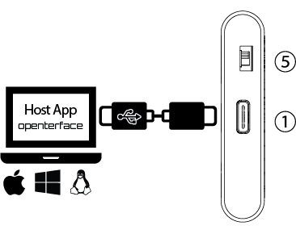

# 사양

## 개요

- 치수: 61 x 13.5 x 53 mm / 2.40 x 0.53 x 2.09 인치 (길이 x 너비 x 높이)
- 무게: 48g
- 케이스: 알루미늄 프로파일 케이스

## 인터페이스

- ①  **호스트 USB-C 포트** (암): USB 디바이스 포트로서, 내장 USB 허브를 통해 데이터 전송을 위해 호스트 컴퓨터에 연결
- ②  **타겟 USB-C 포트** (암): USB 디바이스 포트로서, 내장 USB 허브를 통해 키보드와 마우스 HID 출력을 에뮬레이트하기 위해 호스트 컴퓨터에 연결
- ③  **HDMI 입력 포트 (암)**: 타겟 컴퓨터에서 HDMI 소스 입력
- ④  **스위칭 가능한 USB-A 2.0 포트 (암)**: USB 호스트 포트로서, 호스트 컴퓨터 또는 타겟 컴퓨터에서 한 번에 하나씩 사용 가능, 동시에 사용 불가
- ⑤  **토글 스위치**: USB-A 2.0 포트를 호스트와 타겟 컴퓨터 사이에서 전환하는 스위치

## 전원

- 연결 타입: USB-C 전원 공급. 외부 전원 공급 필요 없음.

## 비디오

- 최대 비디오 입력: HDMI를 통해 최대 3840x2160@30Hz (어댑터 사용 시 VGA, Micro HDMI, DVI 및 기타 비디오 입력 소스도 지원 가능)
- 지원 비디오 해상도: 최대 1920x1080@30Hz
- 비디오 압축 방식: YUV, MJPEG
- 지연 시간: 140 밀리초 이하

## 오디오

- 오디오 캡처 모드: HDMI 내장 오디오

## 환경

- 작동 온도: 0°C ~ 40°C
- 보관 온도: -10°C ~ 50°C
- 습도: 80% RH